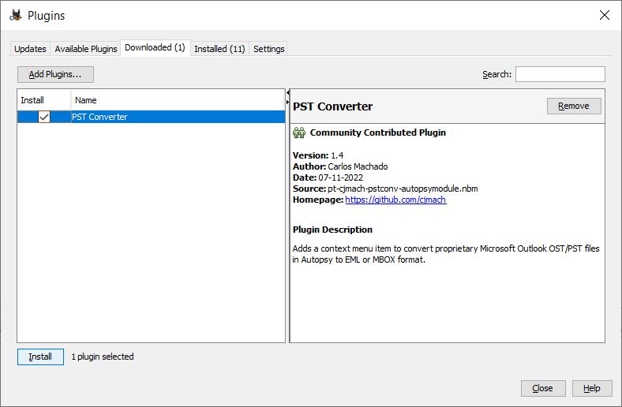
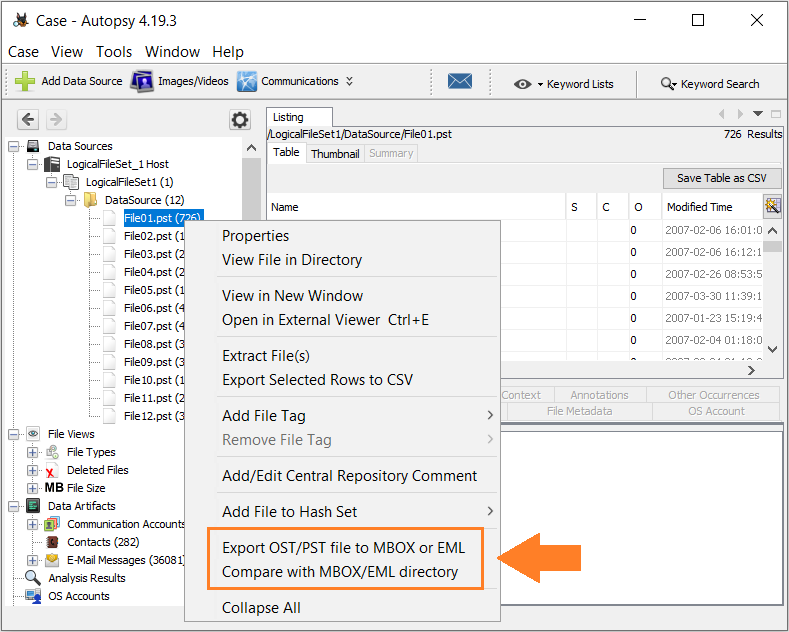
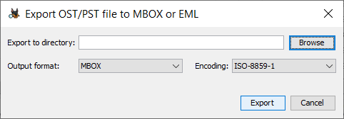
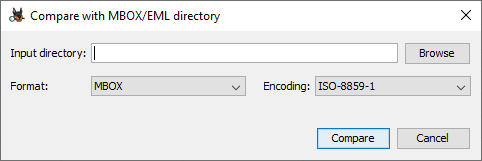
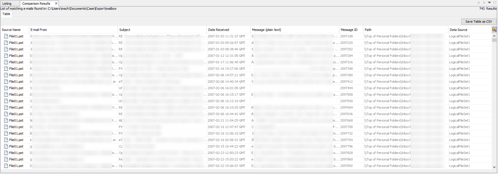

# pstconv-autopsy-module

A NetBeans module that integrates [pstconv](https://github.com/cjmach/pstconv) 
tool in [Autopsy](https://www.sleuthkit.org/autopsy/)&reg;. It provides context 
menu options to convert proprietary Microsoft Outlook OST/PST files to EML or 
MBOX format.

## Introduction

Autopsy&reg; is a digital forensic application used by law enforcement, military, 
and corporate examiners to analyse the contents of a computer. It's built on top 
of NetBeans Platform, a rich client java platform that provides several APIs and 
a module system to help write large desktop applications, like NetBeans IDE for 
example. Autopsy also takes advantage of this module system to provide a set of 
key features such as file identification and indexing, extracting web browser 
bookmarks and navigation history and more.

One of the modules that is included in the default installation is the 'Email 
Parser' module. It can parse and extract e-mail messages in several mail box 
formats, such as Mozilla Thunderbird folders and PST archives and it's also 
possible to do some basic filtering and searching but it lacks features for 
advanced searching, features which are normally found on e-mail client 
applications such as Microsoft Outlook, Mozilla Thunderbird, Opera Mail, just to 
name a few. Also, Autopsy only allows to export either the full PST archive or a 
list of messages in CSV format, but without the full text body (only the first 
160 characters), attachments and headers.

The PSTConv Autopsy Module allows to convert a [Microsoft PST archive](https://learn.microsoft.com/en-us/openspecs/office_file_formats/ms-pst/) 
to MBOX or EML format so that it's possible to import the converted message to 
an e-mail client application for further analysis. 

## Requirements

- Java Runtime Environment 17
- Autopsy 4.21.0

## Installing

Download the latest version of PSTConv Autopsy Module from the [Releases](https://github.com/cjmach/pstconv-autopsy-module/releases) 
(the file with .nbm extension), then open Autopsy and click on the Tools -> Plugins 
menu item. Select the 'Downloaded' tab from the 'Plugins' window and browse to 
the downloaded module file by clicking on the 'Add Plugins...' button. Afterwards, 
hit the 'Install' button to install the module.

## Usage

In order to use this plugin effectively, the user must first run the 'File Identification' 
module so that Autopsy calculates the mime type of each file contained in the 
datasource. Right-clicking on a file with "application/vnd.ms-outlook-pst" or 
"application/vnd.ms-outlook" mime types will popup a context menu with two 
additional items added by the PSConv Autopsy Module.

### Export OST/PST file to MBOX or EML

After selecting this menu item, a dialog is open to allow the user to specify 
the export parameters. By clicking on the 'Browse' button, a directory chooser 
dialog is open to let the user specify the output directory and it's also 
possible to set the output format and the character encoding to use for reading 
the messages text content from the PST archive.

Hit the 'Export' button to start exporting the selected PST archive with the 
chosen output format. It may take a while depending on the PST archive size. 
After the export is finished, the user can open the MBOX or EML directory and 
import it to an e-mail client to analyse the message contents.

### Compare with MBOX/EML directory

This option allows to generate a listing in Autopsy with the PST messages that 
match the messages found on a previously exported MBOX/EML directory. After 
selecting this option a dialog is open to allow to user to specify the path to 
the exported directory and other parameters, as shown in the following figure.

By clicking on the 'Compare' button, the plugin creates a listing almost 
identical to the one generated by Autopsy itself when the user chooses the 
'E-mail Messages' item from the case tree (the only column missing is 'Thread Id').
The plugin reads all message descriptor IDs from the 'X-Outlook-Descriptor-Id' 
header and compares them with the message IDs from the previously selected PST 
archive. If there's a match, then the message is added to the listing. This 
allows the user to compare the exported messages with the original PST messages 
if necessary, or use Autopsy to export the listing to a CSV file, for example.

